# 🎮 뚜벗뚜벗

  
  <h3>아이들 야외 활동 장려 서비스 ‘뚜벗뚜벗’</h3>
  
  

    ✨ <a href="https://pinto-bakery-023.notion.site/0-SSAFY-1173b8f9991f80638044dc13e1c387b9?pvs=4">0ㅣ띠 팀 노션</a>
  

  
   
  
  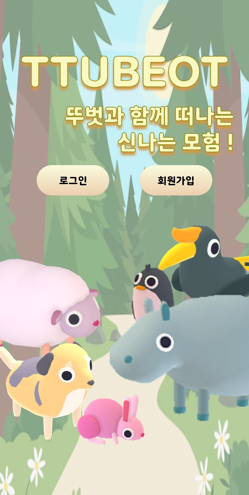
  
   
   
  
  <h3>🏆 수상 내역</h3>
  

    
🥈 SSAFY 11기 자율 프로젝트 우수상 - 삼성전자 주식회사

  

  
   
  

### 📜 목차

---

1. [**프로젝트 일정**](#1)
2. [**프로젝트 개요**](#2)
3. [**서비스 소개**](#3)
4. [**주요 기능**](#4)
5. [**기술 스택**](#5)
6. [**산출물**](#6)
7. [**팀원 소개**](#7)
     

### 🗓️ 프로젝트 일정

---

- 일정: 2024년 10월 14일 - 2024년 11월 19일 (6주)
    

### 🔎 프로젝트 개요

---

요즘 아이들의 일상은 점점 더 실내로, 그리고 디지털 화면 속으로 머물고 있습니다. 뛰어놀던 놀이터는 텅 비었고, 아이들은 자연 속에서 상상력을 펼칠 기회를 잃어가고 있습니다.

육아정책연구소에서 조사한 결과에 따르면 초등학생들의 주평균 실외 활동량이 지속적으로 감소하고 있습니다.

야외활동이 감소하면서 또래와의 교류 기회가 줄어들어 협력과 소통의 기회가 부족해졌으며 다양한 환경에서의 새로운 경험을 접할 기회가 부족해지며 상상력과 창의적 사고를 발달시킬 기회가 줄어들고 있습니다.

저희는 아이들이 자연스럽게 야외활동에 참여하며, 그 과정에서 재미와 성취감을 느낄 수 있는 근본적인 해결책을 고민했습니다. 그래서 **아이들의 야외활동을 자연스럽게 촉진하면서도 재미를 더해주는 서비스, 뚜벗뚜벗**을 만들었습니다.

 

### 🔎 서비스 소개

---

뚜벗뚜벗은 아이들의 야외활동을 자연스럽게 촉진하면서도 재미를 더해주는 서비스입니다.

 

### 🔎 주요 기능

---

- **모험**: 아이들이 야외활동에 자연스럽게 참여할 수 있도록 ‘모험’이라는 컨셉을 선택했습니다.모험을 함께할 특별한 친구가 바로 ‘뚜벗’입니다. 뚜벗은 단순히 귀여운 캐릭터가 아니라, 아이들이 모험을 시작하도록 동기를 부여하는 중요한 역할을 합니다.

- **보물 찾기**: AR 카메라를 활용한 보물 찾기는 모험의 흥미를 극대화합니다. 아이들은 실제 환경에서 보물을 찾으며, 성취감과 재미를 느낄 수 있습니다.

- **걸음수 측정**: 기존의 라이브러리들은 뚜벗 프로젝트에서 사용하는 환경과 호환이 되지 않는 문제가 생겨 안드로이드 내장 센서를 활용하여 걸음수를 측정하는 네이티브 모듈을 직접 만들었습니다. 센서 이벤트 호출 간 최소 간격을 500ms 로 설정하여 전력 효율성을 높였고, 이를 통해 아이는 더 오랜 시간 동안 자신의 뚜벗과 모험을 할 수 있습니다.

- **친구 만나기**: 소통 능력을 키우고자 하는 뚜벗 서비스의 기획 의도에 맞춰 BLE를 활용하여 근접 거리 친구 만나기 기능을 구현했습니다. 먼저 GPS 기준으로 30m 이내 사용자를 감지하면 거리 오차가 적은 BLE 모드로 전환합니다. 그 다음 BLE 신호 세기를 기준으로 3m 이내 친구에게만 친구추가를 보낼 수 있습니다.

- **모험 발자국**: 모험이 끝난 후, 아이들의 여정을 특별한 '모험 발자국'으로 기록합니다. 모험 발자국은 단순한 기록이 아니라, 아이들의 발걸음을 따라 상상 속의 장면을 만들어주는 특별한 디지털 일기입니다. 이를 통해 아이들은 자신의 여정을 창의적으로 기록하고, 성취감을 느낄 수 있습니다. 이 발자국은 아이들의 모험 경로, 획득한 보물, 걸음 수 같은 모험에 대한 정보를 제공합니다.

 

### ⚒️ 기술 스택

---

- **Frontend**

  
  
  
  
  
  
  

- **Backend**

  
  
  
  
  

- **Infra**

  
  
  
  
  

- **Database**

  
  

- **Tool**

  
  
  

 

### 📜 산출물

---

**🖋️아키텍처 구조도**

  

**🖋️ERD**

  

### 🖋️ 주요 기능 화면

---

#### **메인 화면**

<table>
  <tr>
    <td align="center">
      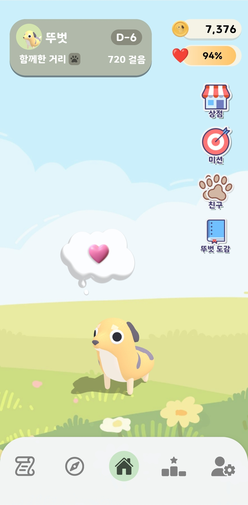
       
      -
    </td>
  </tr>
</table>

---

#### **모험**

<table>
  <tr>
    <td align="center">
      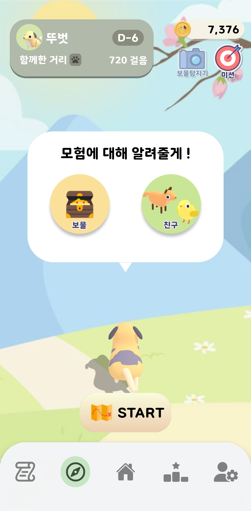
       
      -
    </td>
    <td align="center">
      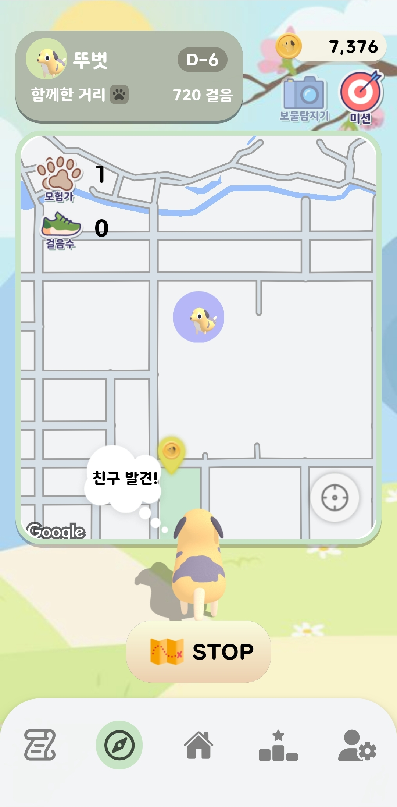
       
      -
    </td>
  </tr>
</table>

---

#### **보물 찾기**

<table>
  <tr>
    <td align="center">
      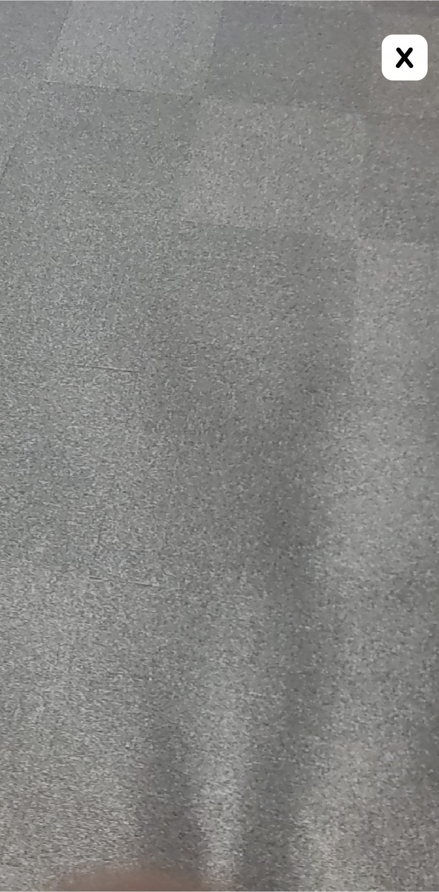
       
      -
    </td>
    <td align="center">
      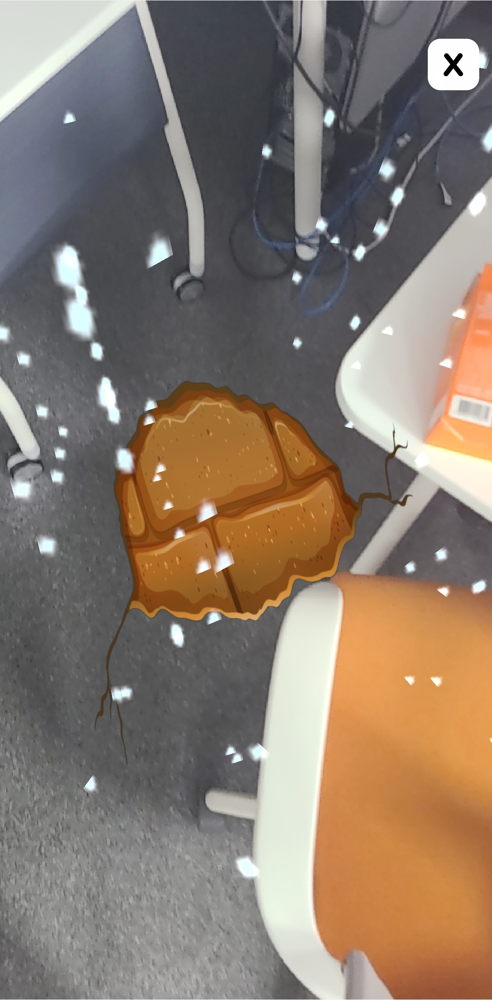
       
      -
    </td>
    <td align="center">
      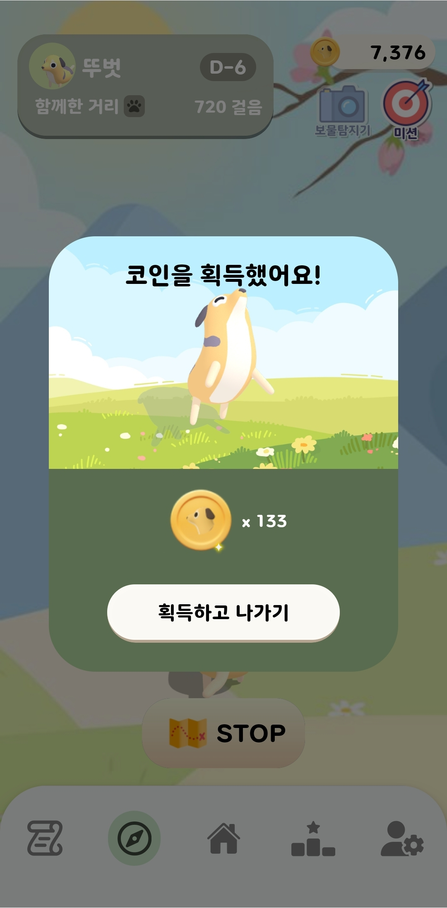
       
      -
    </td>
  </tr>
</table>

---

#### **모험 발자취**

<table>
  <tr>
    <td align="center">
      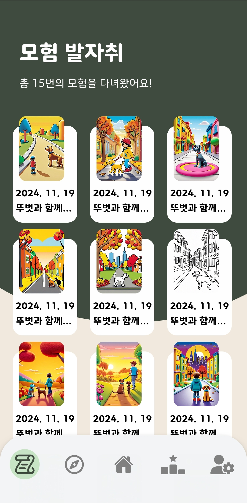
       
      -
    </td>
    <td align="center">
      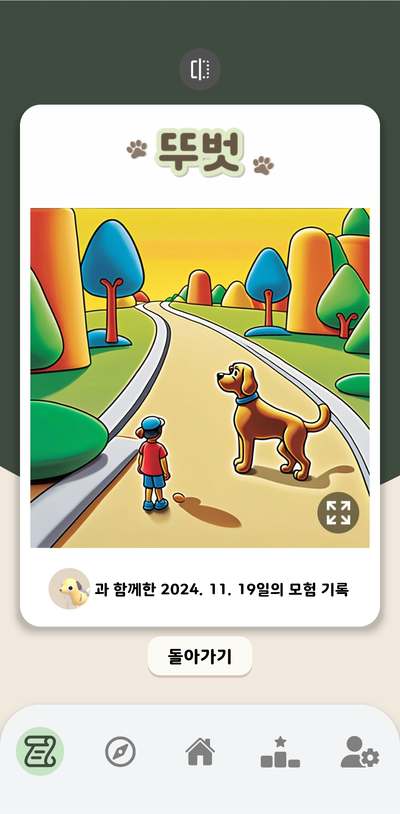
       
      -
    </td>
    <td align="center">
      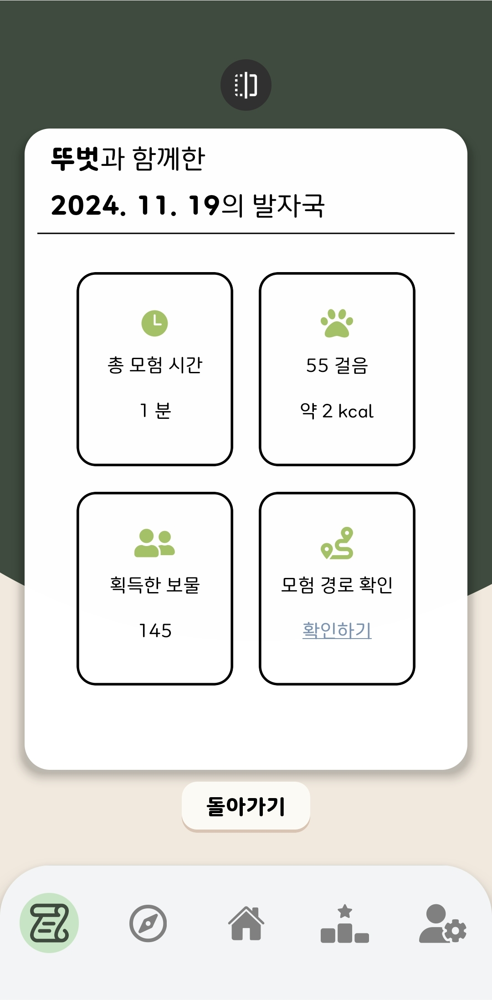
       
      -
    </td>
  </tr>
</table>

---

#### **친구 만나기**

<table>
  <tr>
    <td align="center">
      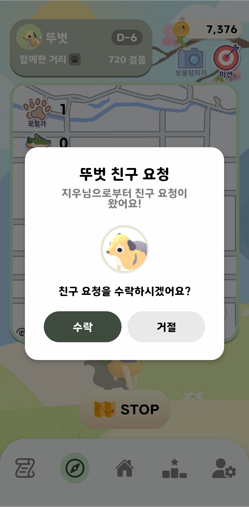
       
      -
    </td>
    <td align="center">
      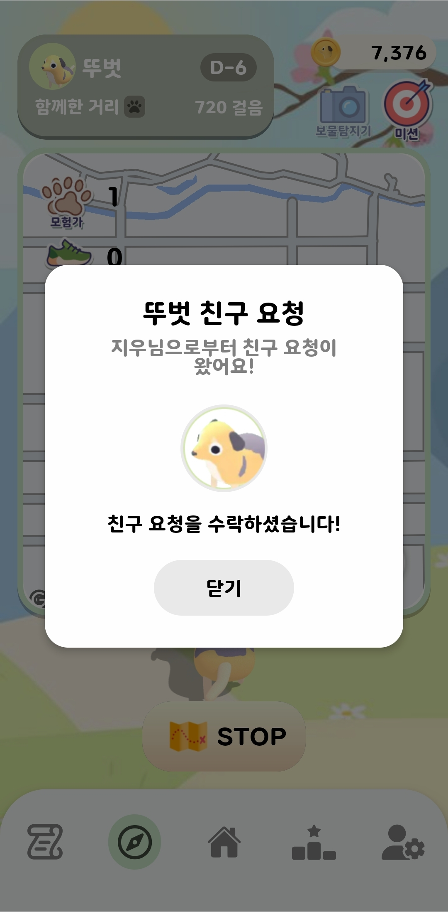
       
      -
    </td>
    <td align="center">
      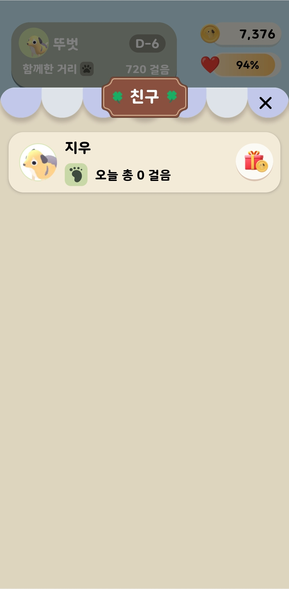
       
      -
    </td>
  </tr>
</table>

---

#### **뚜벗 도감**

<table>
  <tr>
    <td align="center">
      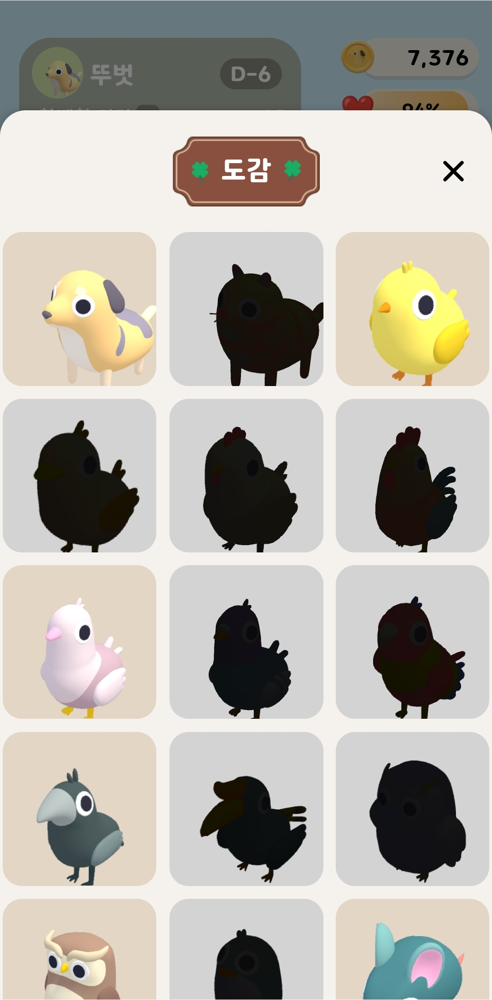
       
      -
    </td>
    <td align="center">
      
       
      -
    </td>
    <td align="center">
      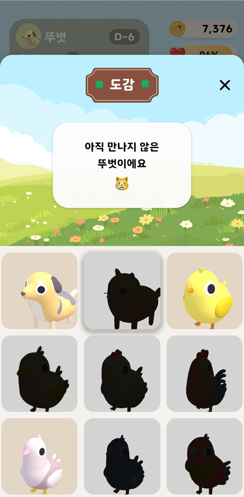
       
      -
    </td>
  </tr>
</table>

---

#### **상점**

<table>
  <tr>
    <td align="center">
      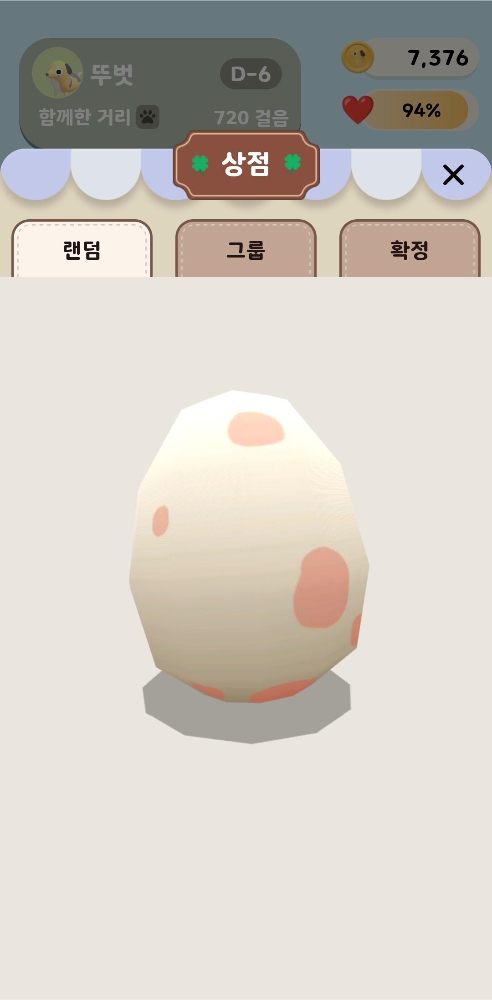
       
      -
    </td>
    <td align="center">
      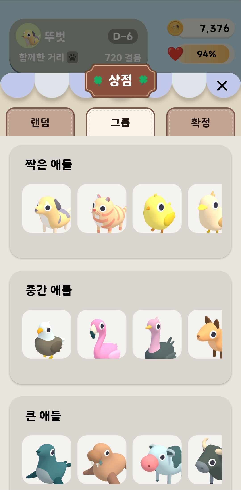
       
      -
    </td>
    <td align="center">
      
       
      -
    </td>
  </tr>
</table>

### 👥 팀원 소개

<table>
  <tr>
    <td align="center">
       
      <b>박연후</b> 
      <i>Backend</i>
    </td>
    <td align="center">
       
      <b>선예림</b> 
      <i>Backend</i>
    </td>
    <td align="center">
      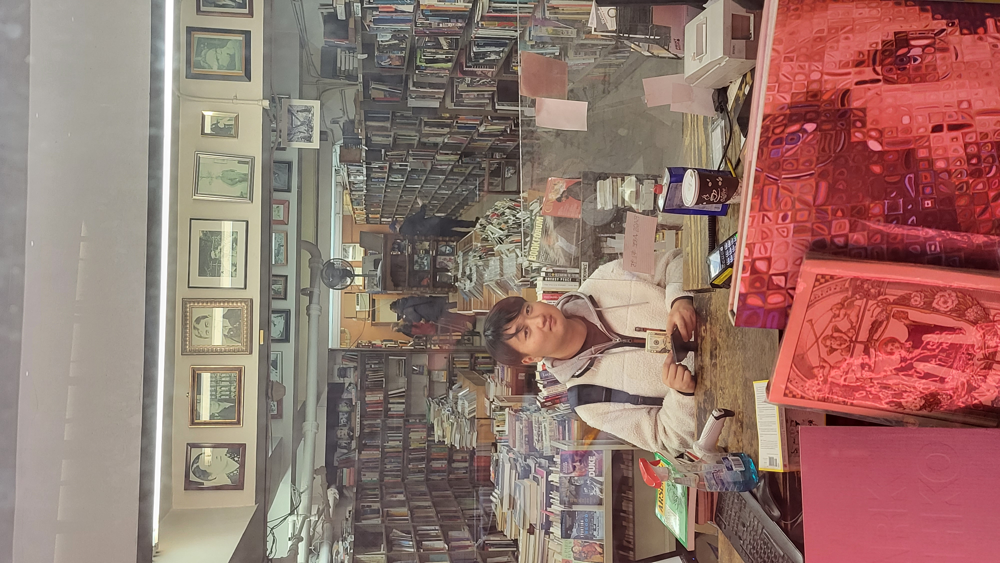 
      <b>김상범</b> 
      <i>Infra, Backend</i>
    </td>
    <td align="center">
       
      <b>최지우</b> 
      <i>Frontend</i>
    </td>
    <td align="center">
       
      <b>차민주</b> 
      <i>Frontend</i>
    </td>
    <td align="center">
       
      <b>이상현</b> 
      <i>Frontend</i>
    </td>
  </tr>
</table>
